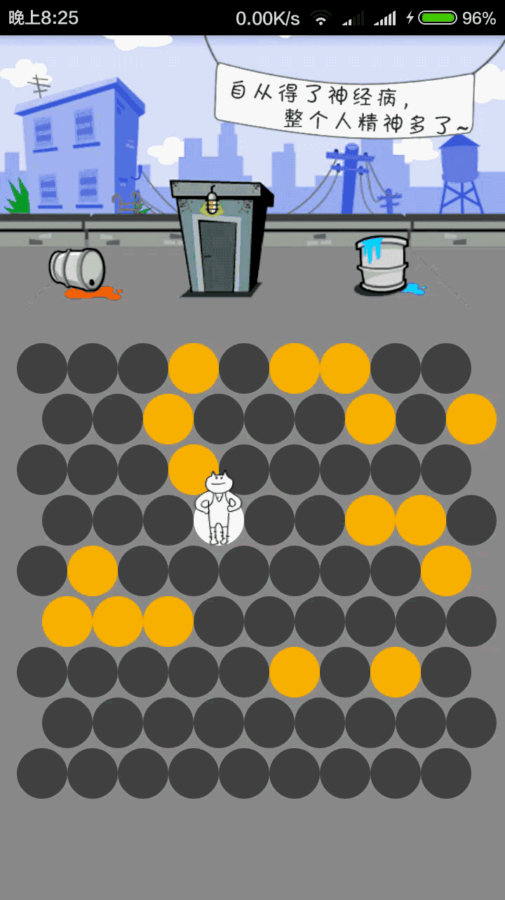

# 围住神经猫 (CrazyCat)

一款经典的六边形网格围堵游戏。玩家通过点击空白格子放置障碍物，阻止小猫逃出地图边缘。

## 游戏截图



## 玩法说明

- 点击地图中的空白位置放置黄色障碍物
- 小猫会自动向边缘移动，尝试逃脱
- 在小猫到达边缘前将其完全围住即可获胜
- 游戏结束后点击屏幕可重新开始

## 游戏模式

| 模式 | 网格大小 | 障碍数 | 说明 |
|------|---------|--------|------|
| 简单 | 8×8 | 16 | 新手推荐 |
| 普通 | 10×10 | 20 | 适中难度 |
| 困难 | 12×12 | 24 | 挑战极限 |
| 限时 | 10×10 | 25 | 10秒倒计时 |

## 技术栈

- **语言**: Java
- **平台**: Android (minSdk 21, targetSdk 34)
- **架构**: SurfaceView 自定义绘图 + 六边形网格算法
- **构建**: Gradle 8.3 + AGP 8.1.0

## 项目结构

```
app/src/main/java/ndnu/tdy/CreazyCat/
├── Activity/
│   ├── BaseActivity.java    # 基类，提供全屏设置
│   ├── MainActivity.java    # 启动页
│   ├── ChooseActivity.java  # 模式选择页
│   └── GameActivity.java    # 游戏页面
└── View/
    ├── GameView.java        # 核心游戏逻辑（网格渲染、猫AI、触摸交互）
    └── Point.java           # 网格单元格数据类
```

## 构建运行

```bash
# 构建 Debug APK
./gradlew assembleDebug

# 安装到设备
./gradlew installDebug
```

## 许可证

仅供学习交流使用。
